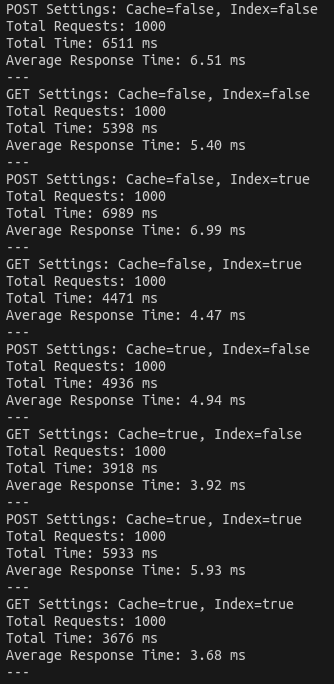

# Case study 1
# Kiến trúc phần mềm - BTL

Tối ưu cho code:

- Thêm lớp ORM
    - Thêm index vào cả **ID** (primary key) và **url**.
    
    ```jsx
    const Link = sequelize.define('Link', {
        id: {
            type: DataTypes.STRING,
            primaryKey: true,
            unique: true, // Đảm bảo rằng ID là duy nhất
            index: true    // Thêm chỉ mục cho trường id
        },
        url: {
            type: DataTypes.STRING,
            allowNull: false,
            unique: true, // Đảm bảo rằng URL là duy nhất
            index: true    // Thêm chỉ mục cho trường url
        }
    });
    
    ```
    
- Hàm `shorturl` gốc chưa tối ưu nếu người dùng nhập 1 url nhiều lần thì sẽ tạo ra nhiều ID lưu trong CSDL, ta chỉ cần lưu 1 url ứng với 1 ID duy nhất thôi.
    - Code tối ưu hơn:
    
    ```jsx
    async function shortUrl(url) {
        // Kiểm tra xem URL đã tồn tại trong cơ sở dữ liệu chưa
        const existingLink = await Link.findOne({ where: { url } });
    
        // Nếu URL đã tồn tại, trả về ID tương ứng
        if (existingLink) {
            return existingLink.id;
        }
    
        while (true) {
            let newID = makeID(5);
            let originUrl = await findOrigin(newID);
            if (originUrl == null) {
                await create(newID, url);
                return newID;
            }
        }
    }
    ```
    
- Thêm Cache trong hàm `findOrigin` , khi tìm kiếm URL gốc thì tìm trong Cache trước, nếu Cache miss thì tìm trong Database và đưa Link vừa tìm được vào lại Cache.

```jsx
function findOrigin(id) {
    const cachedUrl = cache.get(id);
    if (cachedUrl) {
        return Promise.resolve(cachedUrl);
    }
    return Link.findOne({ where: { id } }).then(link => {
        if (link) {
            cache.set(id, link.url, 3600); // Lưu vào cache, hết hạn sau 1 giờ
            return link.url;
        }
        return null;
    });
}
```

- Thêm middleware để kiểm tra các URL hợp lệ:
    - Ví dụ về các URL không hợp lệ
        - Ví dụ: `htp://example.com` (lỗi chính tả ở "http")
        - Ví dụ: `://example.com` (thiếu phần giao thức)
        - Ví dụ: `http://` (không có tên miền)
        - Ví dụ: `example.com` (thiếu giao thức như `http://` hoặc `https://`)
    - Thêm middleware **validateUrl** cho endpoint POST `/create`
        - Code
        
        ```
        function validateUrl(req, res, next) {
            const url = req.query.url;
            const regex = /^(ftp|http|https):\/\/[^ "]+$/;
            if (!url || !regex.test(url)) {
                return res.status(400).send("Invalid URL format");
            }
            next();
        }
        ```
        
- Đo performance: (Ablation Study)
    - Vì code gốc không sử dụng Index và Cache, do đó ta có thể so sánh hiệu năng của hệ thống khi ta thêm dần từng thành phần vào.
    - Đo response time của 2 API với các setting Index và Cache
        - 1k requests
        
        
        
        | Cache | Index | POST (ms) | GET (ms) |
        | --- | --- | --- | --- |
        | x | x | 6.51 | 5.4 |
        | x | v | 6.99 | 4.47 |
        | v | x | 4.94 | 3.92 |
        | v | v | 5.93 | 3.68 |
        - 10k requests
        
        
        
        | Cache | Index | POST (ms) | GET (ms) |
        | --- | --- | --- | --- |
        | x | x | 5.88 | 4.64 |
        | x | v | 7.40 | 3.80 |
        | v | x | 5.10 | 3.97 |
        | v | v | 6.23 | 4.09 |
    
    ### Nhận xét về kết quả:
    
    - Trong cả hai thí nghiệm với 1000 requests và 10000 requests, có thể thấy rằng việc sử dụng cả Cache và Index. Kết quả cho thấy rằng, cả 2 API cho thời gian phản hồi nhanh nhất khi ta sử dụng cài đặt Cache = True, Index = False. Khi ấy, POST API response time khoảng 5ms, GET API response time khoảng 4ms.
